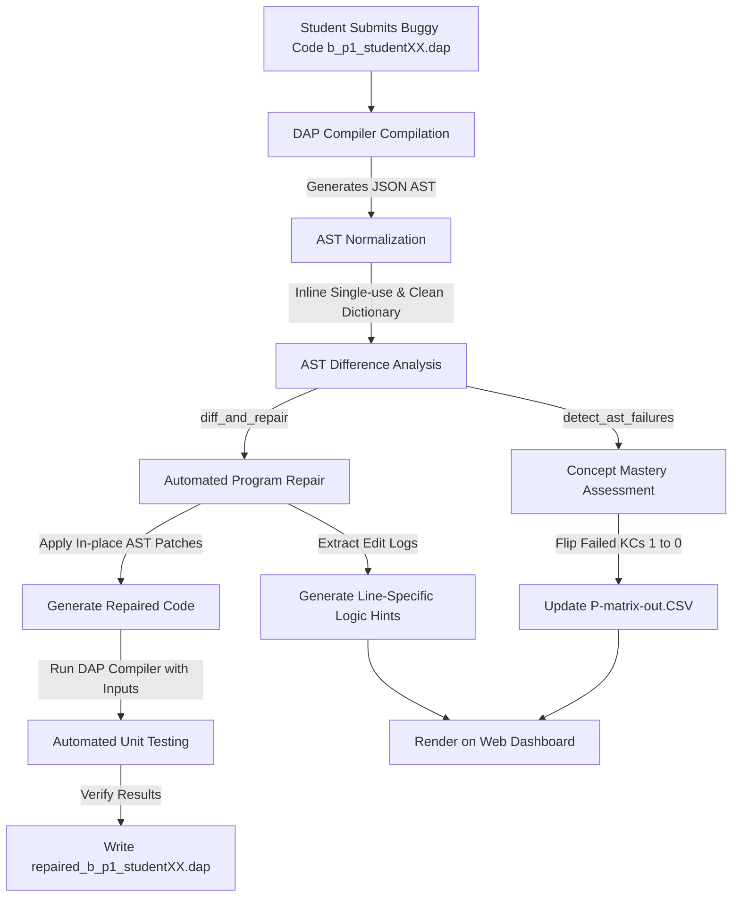

# Student Submission Processing Flow for Problem 1 (p1)

This document describes the end-to-end execution flow of the **Automated Program Repair (APR)** pipeline and **P-Matrix generation** when a student submits an incorrect DAP program for **Problem 1 (p1 - SumToN)**.

---

## 1. Problem Overview (`p1`)
The objective of Problem 1 (`SumToN`) is to write a DAP program that reads an integer `n` and outputs the sum of all integers from `1` to `n`.

* **Correct Reference Solution:**
  ```dap
  program SumToN
  dictionary
      n, i, total : integer
  algorithm
      read n
      total <- 0
      i <- 1
      while i <= n do
          total <- total + i
          i <- i + 1
      endwhile
      write total
  endprogram
  ```

---

## 2. Pipeline Execution Diagram



---

## 3. Step-by-Step Processing Pipeline

### Step A: Compilation & AST Generation
When the student's submission is uploaded/saved (e.g., as `b_p1_studentXX.dap`):
1. The pipeline calls the compiled DAP compiler (`dap.exe`) located in `~/.dap/bin/dap.exe` or `C:/Users/rafia/.dap/bin/dap.exe`.
2. It executes the command:
   ```bash
   dap.exe <filepath> --show-ast-json
   ```
3. If syntax or parser errors are detected, compilation fails, producing a console error log. If compilation succeeds, it yields a JSON-formatted Abstract Syntax Tree (AST).

### Step B: AST Normalization
To prevent trivial syntax differences from affecting repair accuracy, the AST is normalized in repair.py:
* **Variable Inlining**: Single-use assignment variables (declared and assigned once, and used only once elsewhere) are merged directly into their usage points, and the original assignment node is removed.
* **Dictionary Cleanup**: Unreferenced variables in the `algorithm` section are removed from the AST `DictionaryNode`.

### Step C: Q-Matrix Concept Evaluation & P-Matrix Flipping
The script build_pmatrix.py evaluates student performance on required concepts:
1. **Fetch Base Required Concepts**: In the Q-matrix, problem `p1` requires 3 specific concepts:
   * **Concept 1**: Basic variables and outputs (`1`)
   * **Concept 2**: Basic input and arithmetic operations (`1`)
   * **Concept 4**: Iteration and loops (`1`)
   * *Base Q-Matrix Vector:* `[1, 1, 0, 1, 0, 0, 0, 0, 0, 0]`

2. **Run AST Difference**: The buggy AST is compared recursively to the reference AST via `detect_ast_failures(buggy, correct, context)`.
3. **Map Syntax Bugs to Concepts**:
   * **Variable Issues**: A mismatch in assignment variable name (e.g., assigning `n <- total + i` instead of `total <- total + i` in `b_p1_student09.dap`) triggers a failure in **Concept 1** (Basic variables).
   * **Loop Issues**: A mismatch in comparison operators (e.g., using `while i < n` instead of `while i <= n` in `b_p1_student02.dap`) or values inside a loop condition triggers a failure in **Concept 4** (Iteration and loops).
4. **Update P-Matrix**: Any failed concept flips the student's mastery score from `1` to `0` in their vector. The results are written to `data/P-matrix-out.CSV`.

> [!NOTE]
> **Personalized Mastery Score**:
> The Flask server calculates the student's step mastery score as:
> $$\text{Score} = \frac{\text{Sum of Student's Active Required Concepts}}{\text{Sum of Total Required Concepts for Challenge}}$$
> Since `p1` has 3 required concepts, failing **Concept 4** (Loop Condition) yields a score of $\frac{2}{3} \approx 66.7\%$.

---

## 4. Program Repair and Verification

The repair module in repair.py automatically patches the student's code:
1. **AST Alignment**: It aligns the statements of the student's buggy AST with the reference AST using a greedy similarity alignment algorithm.
2. **In-place Patching**:
   * If a value is wrong (e.g., `i <- 0` instead of `i <- 1`), it updates the value node.
   * If an operator is wrong (e.g., `<` instead of `<=`), it replaces the operator node.
   * If a statement is missing or extra, it inserts/deletes nodes to match the reference.
3. **Code Generation**: The repaired AST is translated back into DAP program source code using `ast_to_full_dap()`.
4. **Automated Unit Testing**: The repaired code is temporarily saved and run against three hardcoded unit tests for `p1` in `run_unit_tests()`:
   * **Test 1**: Input `5` $\rightarrow$ Expects Output `15`
   * **Test 2**: Input `10` $\rightarrow$ Expects Output `55`
   * **Test 3**: Input `1` $\rightarrow$ Expects Output `1`
5. **Write Repair Output**: If verification passes, the final corrected code is written to `data/repaired_b_p1_studentXX.dap`.

---

## 5. Hint and Feedback Generation
The differences corrected during the repair phase are recorded as edit logs. The pipeline normalizes the text of these logs and matches them back to line numbers in the student's original submission:
* **Line-Specific Logic Hints**: If a value is incorrect, it produces a targeted prompt:
  > **[Line 7]**: Value mismatch: expected '1', but found '0'
  > * **Your code**: `i <- 0`
  > * **Expected logic**: Contains `'1'`