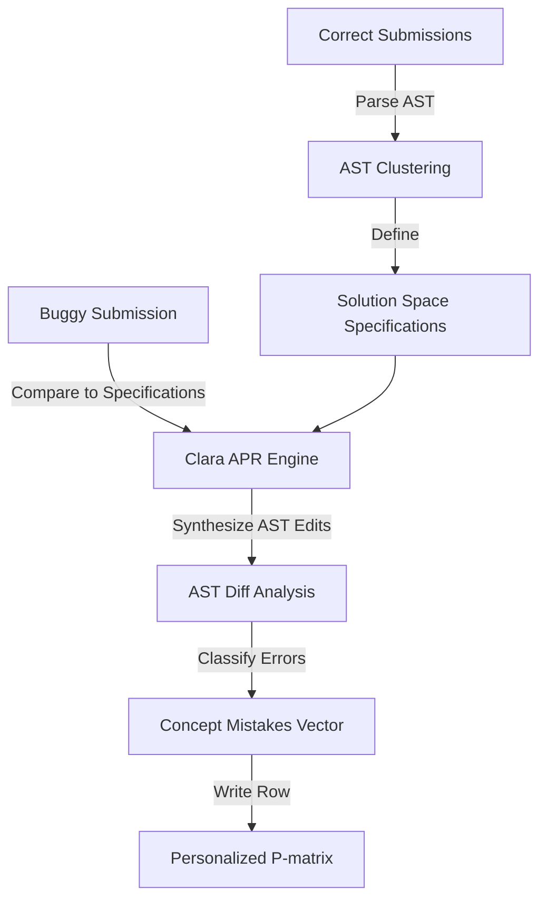
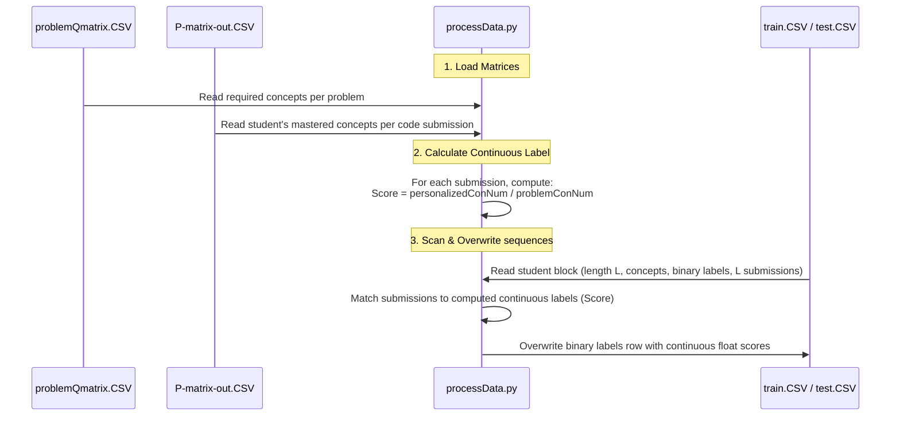
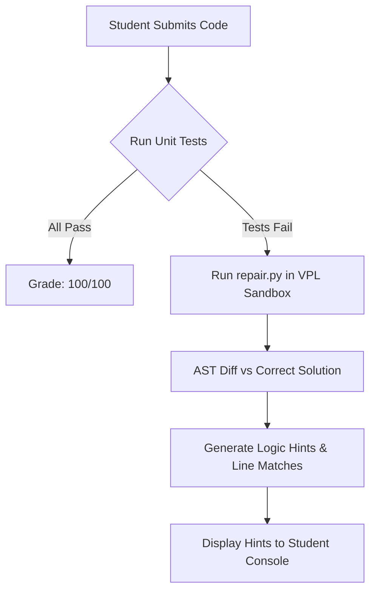

# Automated Program Repair (APR) Behind the Scenes in HELP-DKT

This document explains the "behind-the-scenes" mechanics of how Automated Program Repair (APR) functions within the HELP-DKT framework, how it connects to the Personalized P-Matrix, and how you can implement a custom pipeline for your pseudocode language, **DAP**.

---

## 1. How APR Works

The main role of the APR engine is to convert a raw, buggy program submission into a structured list of concept-level mistakes. It does this automatically in three phases:



### Phase A: Solution Space Mining (Clustering)
1. The engine takes all **correct** student code submissions for a specific challenge.
2. It parses them into ASTs and clusters them using tree similarity metrics.
3. The centroid of each cluster represents a distinct, correct logic path to solve the challenge. These centroids act as the **formal specifications**.

### Phase B: Repair Synthesis (Clara Engine)
1. When a student submits a **buggy** program (prefixed with `b_...`), the engine parses it into an AST.
2. It finds the closest correct specification (cluster centroid) in the solution space.
3. The engine synthesizes a patch by calculating the minimal tree edits (Insert, Delete, Update AST nodes) required to transform the buggy AST into the correct specification.

### Phase C: Error Classification to P-Matrix
1. Every AST node edit corresponds to a programming concept (e.g., modifying a loop condition node matches the "Iteration" concept).
2. The engine classifies the edits into concept-level successes or failures.
3. The result is written directly into `P-matrix-out.CSV` as a row mapping the filename to a binary vector representing the 10 concepts:
   `b_362_13122_1.py, 1, 0, 1, 0, 1, 0, 0, 0, 0, 0`

---

## 2. Is there an APR script from the authors?

**No.** The authors did not release the source code of their Clara-based APR engine in this repository. 

### Why is the APR Automation Script missing?
* **Offline Pre-computation:** In the HELP-DKT research project, the authors processed their static dataset of 9,119 student codes offline beforehand. They saved the final results directly in [P-matrix-out.CSV](file:///c:/Users/rafia/Documents/Belajar_Program/belajar_python/HELP_DKT/HELP-DKT/Code_HELP_DKT/data/ModelInput/P-matrix-out.CSV), allowing the main repository to stay clean, lightweight, and focused solely on model training (`Code_HELP_DKT`) and program embeddings (`Code_Program_Embeddings`).

### How does the engine know the student code is wrong?
* **Unit Testing:** The student's code is executed against a set of input/output test cases (unit tests). If the code fails any test case, it is labeled as buggy (`b_...`). If it passes all tests, it is labeled as correct (`c_...`).

### Does the lecturer have to write the correct solution?
* **No, the correct answers are crowdsourced.** 
* The lecturer only needs to write the **unit tests**. 
* The system automatically collects any student submission that passes all unit tests, parses its AST, and adds it to a "solution space" of correct templates. When a buggy code is submitted, Clara compares it to the closest matching correct AST template from this student-submitted pool and calculates the minimal tree edits (e.g., changing a comparison operator or replacing `Num(1)` with `Num(0)`) needed to make the code pass the unit tests.

---

## 3. Designing our own DAP-to-P-Matrix Script

Since you are evaluating a custom language (**DAP**), you must construct your own pipeline to populate the P-matrix. Writing a full Clara-based repair synthesizer for DAP is highly complex. However, you can write an **automated test-driven script** that achieves the *exact same result* without needing full program synthesis.

Below is an architecture showing how a custom script can automatically process student submissions and write directly to the P-matrix.

### The Testing Script (Python example)

You can write a script like this to automate the creation of the P-matrix for your student database:

```python
import subprocess
import json
import csv

# Map your test cases to the 10 programming concepts
# 1: variables, 2: condition, 3: while-loop, 4: for-loop, 5: array, etc.
CONCEPT_MAPPING = {
    "test_case_1": 1,  # Tests basic dictionary declaration
    "test_case_2": 2,  # Tests conditional branch (if-else)
    "test_case_3": 3,  # Tests while-loop execution
    "test_case_4": 5,  # Tests array indexing
}

def run_dap_file(filepath, input_data):
    """Runs the DAP compiler with input data and returns output/error."""
    try:
        process = subprocess.Popen(
            ["dap", filepath],  # calls the compiled DAP binary
            stdin=subprocess.PIPE,
            stdout=subprocess.PIPE,
            stderr=subprocess.PIPE,
            text=True
        )
        stdout, stderr = process.communicate(input=input_data, timeout=5)
        return stdout.strip(), stderr.strip()
    except subprocess.TimeoutExpired:
        process.kill()
        return "", "Timeout"

def evaluate_submission(filepath, challenge_id):
    """Evaluates a submission against test cases and builds the concept vector."""
    # Start with a base vector of zeros (representing 10 concepts)
    concept_vector = [0] * 10
    
    # Run the DAP file with --show-ast to verify syntax structure if necessary
    # (Optional: check if certain AST nodes exist like loops/conditionals)
    
    # Run against test cases
    # Example: Challenge 362 covers concepts 1, 2, 3, 5
    test_cases = {
        "test_case_1": {"input": "5\n", "expected": "25"},
        "test_case_2": {"input": "-2\n", "expected": "0"},
    }
    
    for case_name, data in test_cases.items():
        output, err = run_dap_file(filepath, data["input"])
        
        # Determine success
        if output == data["expected"] and not err:
            concept_index = CONCEPT_MAPPING[case_name] - 1  # 0-indexed
            concept_vector[concept_index] = 1
            
    return concept_vector

def update_p_matrix(filepath, challenge_id, p_matrix_path):
    """Evaluates and appends/updates the student's entry in P-matrix CSV."""
    vector = evaluate_submission(filepath, challenge_id)
    filename = filepath.split("/")[-1]
    
    # Format: filename, c1, c2, c3, ..., c10
    row = [filename] + [str(val) for val in vector]
    
    with open(p_matrix_path, "a", newline="") as f:
        writer = csv.writer(f)
        writer.writerow(row)
    print(f"Successfully processed {filename} into P-Matrix: {vector}")
```

### Key Takeaway
By running this evaluation script inside your LMS (such as a Moodle VPL post-compilation hook), you can automatically generate the `P-matrix-out.CSV` rows dynamically. The HELP-DKT model can then be trained on this CSV exactly like the original paper.

---

## 4. Keypoints: P-Matrix Concepts and Automated Generation

### What do the 10 columns in the P-Matrix represent?
They represent the student's mastery of **10 core programming concepts (Knowledge Components)** defined in the syllabus:
1. $c_1$: Basic variables / output
2. $c_2$: Basic input / arithmetic operations
3. $c_3$: Conditionals & comparison branching (`if-else` blocks)
4. $c_4$: Iteration & Loops (`while` / `for`)
5. $c_5$: Modulo arithmetic (even-odd checks)
6. $c_6$: Arrays & Lists (sequence data structures)
7. $c_7$: Tuples
8. $c_8$: Dictionaries (key-value maps)
9. $c_9$: Factorial calculation
10. $c_{10}$: Complex logic (sorting algorithms, etc.)

### How are the `0` and `1` values determined?
* **For Correct Code (`c_...`):** Every required concept for the challenge is automatically marked as `1` because they successfully passed all unit tests.
* **For Buggy Code (`b_...`):** The submission starts with the base required concept vector. The automated parser then uses AST diffing against a correct solution. If it finds a mismatch (e.g., inside an `IfNode`), it identifies that the student failed the concept associated with that node type (e.g., Concept 3) and flips that value to `0`.

### How does the lecturer configure a new problem?
1. **Define base required concepts:** Add a row mapping the new challenge ID to its required concepts (e.g., `888, 1, 0, 1, 1, 0, 0, 0, 0, 0, 0`) in [problemQmatrix.CSV](file:///c:/Users/rafia/Documents/Belajar_Program/belajar_python/HELP_DKT/HELP-DKT/Code_HELP_DKT/data/ModelInput/problemQmatrix.CSV).
2. **Implement automated P-Matrix generator ([build_pmatrix.py](file:///c:/Users/rafia/Documents/Belajar_Program/belajar_python/HELP_DKT/Automated_Program_Repair/build_pmatrix.py)):**
   * Uses `dap --show-ast-json` to extract structural trees.
   * Performs recursive tree comparison.
   * Maps differences (like mismatching operators in `BinOpNode` loops/conditionals) to concept failures.
   * Saves the generated rows directly to [P-matrix-out.CSV](file:///c:/Users/rafia/Documents/Belajar_Program/belajar_python/HELP_DKT/Automated_Program_Repair/data/P-matrix-out.CSV).

---

## 5. Step A: Continuous Labeling & Data Processing Pipeline

Continuous Labeling acts as the bridge between the APR output (`P-matrix-out.CSV`) and the DKT model training input (`train.CSV` and `test.CSV`).

### The Theory: Why Continuous Labeling?
In classic Deep Knowledge Tracing (DKT), student performance at each time step is treated as a binary variable:
* `1` for passing all unit tests (success)
* `0` for failing any unit test (failure)

However, programming is a multi-concept task. A student might write a program that implements $3$ out of $4$ required concepts correctly, but fails a unit test because of a minor conditional operator bug. Treating this as a flat `0` ignores their partial knowledge.

**Step A** converts the binary label sequence into a **continuous mastery ratio**:
$$\text{Score} = \frac{\text{personalizedConNum}}{\text{problemConNum}}$$

Where:
* $\text{personalizedConNum}$ is the number of concepts the student correctly implemented in their code submission (sum of `1`s in their [P-matrix-out.CSV](file:///c:/Users/rafia/Documents/Belajar_Program/belajar_python/HELP_DKT/Automated_Program_Repair/data/P-matrix-out.CSV) row).
* $\text{problemConNum}$ is the total number of concepts required to solve that problem (sum of `1`s in their [problemQmatrix.CSV](file:///c:/Users/rafia/Documents/Belajar_Program/belajar_python/HELP_DKT/HELP-DKT/Code_HELP_DKT/data/ModelInput/problemQmatrix.CSV) row).

This formulation provides:
1. **Smoother gradients** for the LSTM model backpropagation.
2. **Finer tracking** of partial knowledge state over time.

---

### Code Walkthrough: `processData.py`

The script [processData.py](file:///c:/Users/rafia/Documents/Belajar_Program/belajar_python/HELP_DKT/HELP-DKT/Code_HELP_DKT/processData.py) automates this labeling process. Let's break down its key functions:

#### 1. Loading the Matrices
```python
def ReadProblemQmatrix():
    # Loads problemQmatrix.CSV mapping each problem ID to its required binary concept vector
    # e.g., problemQmatrix['362'] = ['1', '0', '1', '0', '1', '0', '0', '0', '0', '0']
    ...

def ReadPersonalizedQmatrix():
    # Loads P-matrix-out.CSV mapping each student's file submission (e.g., b_362_10035_1.py)
    # to their personalized concept vector after APR evaluation
    ...
```

#### 2. Calculating the Continuous Score (`GetNewLabel`)
This calculates the ratio of concepts mastered versus required.
```python
def GetNewLabel():
    global problemQmatrix
    global personalizedQmatrix
    global newLabel
    for item in personalizedQmatrix.keys():
        # Filename format: {status}_{problemId}_{studentId}_{attempt}.py (e.g. b_362_10035_1.py)
        # Split by '_' and get problemId at index 1
        problem = item.split('_')[1]
        
        # Count total required concepts for this problem
        problemConNum = 0
        for _ in problemQmatrix[problem]:
            problemConNum += int(_)
            
        # Count mastered concepts by student in this submission
        personalizedConNum = 0
        for _ in personalizedQmatrix[item]:
            personalizedConNum += int(_)
            
        # Compute mastery ratio (Score in range [0.0, 1.0])
        newLabel[item] = float(personalizedConNum / problemConNum)
    return
```

#### 3. Rewriting Training and Testing Sequences (`WriteNewLabel`)
The student sequences in `train.CSV` and `test.CSV` are formatted in repeating blocks of:
1. **Sequence Length ($L$):** Number of steps (e.g., `6`).
2. **Sequence of Concept IDs:** The sequence of concepts tested at each step.
3. **Sequence of Labels:** Original binary grades (to be overwritten by continuous floats).
4. **Submissions rows:** $L$ rows containing submission filenames (e.g., `b_362_10053_1.py`) and their program embeddings.

`WriteNewLabel()` uses a sliding block algorithm to find and overwrite the **Sequence of Labels** with the computed continuous scores:
```python
def WriteNewLabel():
    for path in ['train.CSV', 'test.CSV']:
        dataDir = {}
        # Read the file line by line into a dictionary
        with open(dirPath+'/Code_HELP_DKT/data/ModelInput/'+path, 'r', encoding='utf-8-sig', newline='') as fileInput:
            reader = csv.reader(fileInput)
            _ = 0
            for row in reader:
                dataDir[_] = row
                _ += 1
            
            i = 0
            # Slide over each line in the CSV file
            while i < len(dataDir.keys()):
                count = 1
                tmp = []  # To hold new continuous labels for this student block
                
                # Check consecutive lines following index i. 
                # If they start with 'c' (correct) or 'b' (buggy), they are submission rows.
                while (i+count) < len(dataDir.keys()) and (dataDir[i+count][0].split('_')[0] == 'c' or dataDir[i+count][0].split('_')[0] == 'b'):
                    tmp.append(newLabel[dataDir[i+count][0]])
                    count += 1
                
                # If we found submission rows, overwrite the label row (at index i) with the continuous labels
                if count != 1:
                    dataDir[i] = tmp
                
                # Advance index past the label row and all processed submission rows
                i += count
                
        # Write the updated rows back to the file
        with open(dirPath+'/Code_HELP_DKT/data/ModelInput/'+path, 'w', encoding='utf-8-sig', newline='') as fileInput:
            writer = csv.writer(fileInput)
            for i in range(len(dataDir.keys())):
                writer.writerow(dataDir[i])
    return
```

---

### Step-by-Step Execution Diagram
Here is how `processData.py` transforms the CSV sequences:



---

## 6. Integrating Live Logic Feedback (Hints) in Moodle VPL

When a student submits buggy code in Moodle Virtual Programming Lab (VPL), we want them to receive helpful logic-level hints (such as pointing out the exact line and error type) instead of just seeing "Failed Unit Tests".

We have modified [repair.py](file:///c:/Users/rafia/Documents/Belajar_Program/belajar_python/Automated_Program_Repair/repair.py) to track AST differences during diffing and resolve them to original line numbers in the student's code using normalized line-matching.

### Moodle VPL Integration Architecture

Moodle VPL executes test and evaluation scripts inside a sandboxed jail server. The execution is controlled by specific shell scripts:
* **`vpl_run.sh`:** Executed when the student clicks "Run".
* **`vpl_evaluate.sh`:** Executed when the student clicks "Evaluate" (magnifying glass) to submit and receive a grade.

We can configure **`vpl_evaluate.sh`** to execute the AST repair script in the background and print feedback to the student's console.



### Example `vpl_evaluate.sh` Script

Here is an example of how you can configure Moodle VPL's `vpl_evaluate.sh` to run this:

```bash
#!/bin/bash
# 1. Load default VPL variables and compilation utilities
. common_functions.sh

# 2. Compile student code
# (Assuming 'dap' is installed globally on the jail server)
dap $VPL_SUBFILE -o student_program.exe > /dev/null 2> compile_errors.txt

if [ -s compile_errors.txt ]; then
    echo "--- COMPILATION ERROR ---"
    cat compile_errors.txt
    exit 1
fi

# 3. Run default I/O unit tests
run_default_tests > test_results.txt 2>&1
tests_passed=$?

if [ $tests_passed -eq 0 ]; then
    echo "Grade: 100"
    echo "Congratulations! All unit tests passed."
else
    echo "Grade: 0"
    echo "Some unit tests failed."
    echo ""
    echo "Running Automated Program Repair (APR) to find your logic bug..."
    
    # 4. Execute the repair script to find logic mismatches
    # We pass the path to the student's submission and reference solution directory
    python3 repair.py
fi
```

### What the Student Sees

When the student's logic is wrong (e.g., in `b_l8_student.dap`, using `<` instead of `>` on line 9), they will see the following output printed directly in Moodle VPL:

```text
Grade: 0
Some unit tests failed.

Running Automated Program Repair (APR) to find your logic bug...

============================================================
   AUTOMATED FEEDBACK - LOGIC HINTS FOR STUDENT
============================================================
* [Line 9]: Comparison operator mismatch: expected '>', but found '<'
  -> Your code:       if palingKecil < n then
  -> Expected logic:  Contains '(palingKecil > n)'
============================================================
```

This allows the student to immediately locate the bug and learn from their mistakes without the lecturer needing to write manual hints for every possible mistake.

---

## 7. Frequently Asked Questions (FAQ) for Lecturer Presentation

### Q: If the very first student submission is buggy, how does the system compare it when no correct student code exists yet?

**A: The Lecturer's Reference Solution (Seed Code) solves this cold-start problem.**

1. **The Seed Code:** When the lecturer creates a programming challenge, they must upload at least one correct reference implementation (the seed).
2. **Initial Solution Space:** Initially, this seed code's AST is the only correct template in the solution pool.
3. **Crowdsourcing Growth:**
   * If the first student's code is buggy, it is compared directly to the lecturer's seed code AST.
   * If that student's code used a different logic structure (e.g., a `while` loop instead of a `for` loop), it forms a new cluster centroid. Subsequent buggy submissions will then be compared to whichever centroid is structurally closest (i.e. minimizing tree edit distance).

### Q: Where do we put the Seed Code (Reference Solution) in the Automated_Program_Repair folder?

**A: In the `data/` folder, using the `c_` filename prefix.**

Our system maps submissions by matching the **Challenge ID** extracted from filenames. In the [data/](file:///c:/Users/rafia/Documents/Belajar_Program/belajar_python/HELP_DKT/Automated_Program_Repair/data) folder:
1. **Buggy Student Submissions:** Must be prefixed with `b_` (e.g., `b_l8_student.dap`, where `l8` is the Challenge ID).
2. **Lecturer Seed Code:** Must be prefixed with `c_` and contain the Challenge ID (e.g., `c_l8_reference.dap`).

#### How the backend finds it (`repair.py`):
```python
def find_reference_file(buggy_filename, directory):
    # Splits b_l8_student.dap to extract challenge ID 'l8'
    parts = buggy_filename.split("_")
    challenge_id = parts[1] if len(parts) > 1 else ...
    
    # Searches directory for a correct file ('c_') containing 'l8'
    for f in os.listdir(directory):
        if f.startswith("c_") and challenge_id in f:
            return os.path.join(directory, f)
    return None
```
To add a new problem, you simply drop your correct reference file (e.g., `c_problem9_seed.dap`) and student submissions (e.g., `b_problem9_user12.dap`) into the `data/` folder.

### Q: Does the lecturer have to provide a Seed Code for each and every problem?

**A: Yes, absolutely. Automated Program Repair is problem-specific.**

1. **Why it's required:** You cannot repair a buggy submission for a "factorial calculator" using the correct code from a "sorting algorithm". The logical structures and target algorithms are completely different. Therefore, each problem in the syllabus must have its own correct reference template(s).
2. **Crowdsourcing the Logic variations:** The lecturer is not expected to write all possible correct ways to solve a problem. They only write **one correct baseline seed code** (the template they use to verify their unit tests). 
3. **Automatic Pool Growth:** As students submit their code to Moodle, those who pass all unit tests have their ASTs automatically harvested by the system. The APR engine clusters these correct codes on the fly. This way, if a student solves the problem using an alternative logic (like `while` loop instead of `for` loop), the system automatically learns that correct pattern and adds it to the solution space without any manual intervention from the lecturer.

### Q: Why are the correct seed codes and student raw submissions missing from the official HELP-DKT GitHub repository?

**A: Because the APR step was performed entirely offline.**

The authors designed the GitHub repository solely to train the DKT model (`Code_HELP_DKT`) and generate program embeddings (`Code_Program_Embeddings`). 
* The **9,119 raw student codes** and the **Clara APR engine** contain proprietary code and student data, so the authors kept them private.
* Instead of running the APR on-the-fly during training, they pre-processed all 9,119 student codes offline, calculated the concept mistakes, and saved the final outputs directly in [P-matrix-out.CSV](file:///c:/Users/rafia/Documents/Belajar_Program/belajar_python/HELP_DKT/HELP-DKT/Code_HELP_DKT/data/ModelInput/P-matrix-out.CSV).
* Therefore, the DKT training code only needs `P-matrix-out.CSV` and `train.CSV`/`test.CSV` (which contain pre-computed NLP embeddings) to run.

### Q: What are the "identified error types" in the HELP-DKT pipeline, and how do they map to concepts?

**A: The APR engine classifies AST mismatches into 4 major error categories and maps them to cognitive concepts.**

As illustrated in the pipeline diagram and research paper:
1. **Operator Mismatch (`OP`):** The student used the wrong operator (e.g., `<` instead of `>` in a loop condition).
2. **Variable Mismatch (`VA`):** The student referenced an incorrect variable name, or left a variable uninitialized.
3. **Constant Mismatch (`CO`):** The student used the wrong numeric value or string literal (e.g., `-241231` vs `241231`).
4. **Expression Mismatch (`EX` / `ST`):** Structural syntax mismatches in statement blocks, strings, or function calls.

#### How they map to concepts (KCs) in the P-matrix:
The system looks at the **syntactic context** of where the error occurred in the AST:
* An **Operator Mismatch** inside an `IfNode` statement condition $\rightarrow$ maps to **Concept 3 (Conditionals)**.
* An **Operator Mismatch** inside a `WhileNode` loop condition $\rightarrow$ maps to **Concept 4 (Iteration & Loops)**.
* A **Variable Mismatch** inside a variable declaration or assignments block $\rightarrow$ maps to **Concept 1 (Variables & Output)**.
* A **Constant Mismatch** inside an arithmetic expression $\rightarrow$ maps to **Concept 2 (Input & Arithmetic)**.

If any of these error types are identified for a concept, the student's mastery value for that concept is flipped to `0` in their personalized P-matrix row.

### Q: Are there only 4 error categories? Can we add more based on the research paper?

**A: No, we are not limited to 4 error categories. We can add as many as needed to match the syllabus.**

1. **What the paper did:** In the research paper (specifically Figure 1 and Section "Personalized Q-matrix"), the authors used 5 basic error classifications for the simple Triangle Area challenge: **Constant (`CO`)**, **Variable (`VA`)**, **Operator (`OP`)**, **String (`ST`)**, and **Expression (`EX`)**.
2. **Error Types vs. Concepts:** Do not confuse *error types* with *P-matrix columns*. The 10 columns of the P-matrix are the **Syllabus Concepts (KCs)**. The error types are simply the classifications of the AST edits.
3. **How to add more:** Since we are using an AST parser, we can easily define more detailed error classifications based on new AST node types. For example:
   * **Indexing Mismatch (`IX`):** Mismatches in index lookups (e.g. `arr[i]` vs `arr[i-1]`) mapping to Concept 6 (Arrays/Lists).
   * **Function Call Mismatch (`FN`):** Passing the wrong number of arguments or wrong argument types mapping to Concept 10 (Complex logic/Functions).
   * **Dictionary Key Mismatch (`DK`):** Invalid dictionary keys or structural initialization mapping to Concept 8 (Dictionaries).
   * **Loop Iteration Mismatch (`LP`):** Mismatch in loop counters or missing updates mapping to Concept 4 (Iteration & Loops).

To add these, we simply extend the recursive diffing function in `repair.py` (`diff_and_repair`) to check for these nodes (like `CallNode` argument lengths, or `VarAccessToken` index nodes) and flag the corresponding custom error categories.


